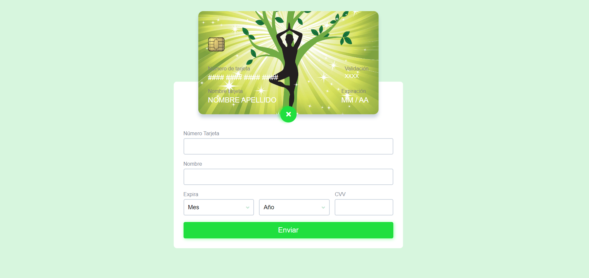

# Card Validation

- Mi proyecto trata de una pagina de bienestar, en este caso se hará el pago por clases de yoga. Este servicio es para facilitar el pago por medios digitales con tarjeta de crédito o debito, ya que en los tiempos de ahora es mucho más practico hacer pagos por internet (al menos para una gran parte de las personas).

- Pensé en que idealizando que la pagina esta completa al hacer clic en "pagar membresía" te lleva a una ventana donde se hace el pago, llenas todos los datos, allí es donde verificas que todos los datos son correctos y luego al hacer clic en pagar, si todo esta bien se envia un formulario con los siguiente pasos para su inscripción, claro en este caso no se incluye estos detalles, solo se muestra donde esta la tarjeta.

- Este es el Resultado de la pagina.

